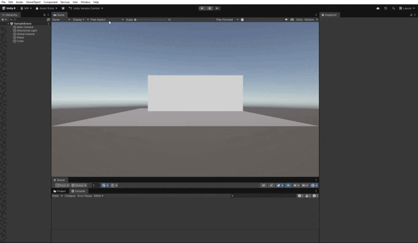

# practica-camara-audio

El CameraManager gestiona la cámara, iniciando, pausando o deteniendo la captura y permitiendo obtener frames individuales como texturas. El CameraInput conecta la cámara con el teclado, usando S para iniciar, P para pausar, D para detener y X para capturar y guardar imágenes automáticamente en una carpeta del proyecto. Por último, CameraDisplay muestra el video de la cámara en un objeto de la escena, actualizando la textura en cada frame para reflejar el video en tiempo real.

