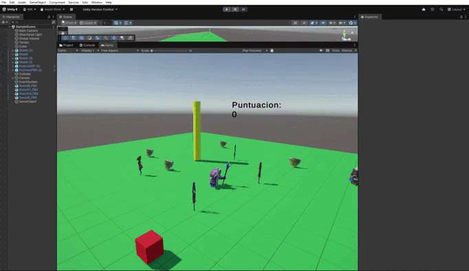
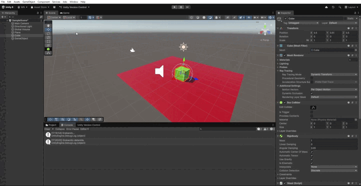

# practica-camara-audio

El CameraManager gestiona la cámara, iniciando, pausando o deteniendo la captura y permitiendo obtener frames individuales como texturas. El CameraInput conecta la cámara con el teclado, usando S para iniciar, P para pausar, D para detener y X para capturar y guardar imágenes automáticamente en una carpeta del proyecto. Por último, CameraDisplay muestra el video de la cámara en un objeto de la escena, actualizando la textura en cada frame para reflejar el video en tiempo real.

Para los audios realizamos los siguientes scripts (junto a asignar lo AudioSource y AudioClip).
El script PushToRecord permite grabar audio directamente desde el micrófono mientras se mantiene presionada la tecla P. Al soltar la tecla, la grabación se detiene automáticamente y el clip grabado se asigna a un AudioSource, permitiendo reproducirlo luego mediante el método PlayRecorded. La grabación está limitada a 10 segundos y se puede ajustar la frecuencia de muestreo con sampleRate, luego reproducimo este sonido en el script de movimiento, para que cada vez que mueva el cubo suene el clip.

El script observadores, reproduce sonidos específicos asociados a cada tipo de colisión usando AudioSource y AudioClip.

